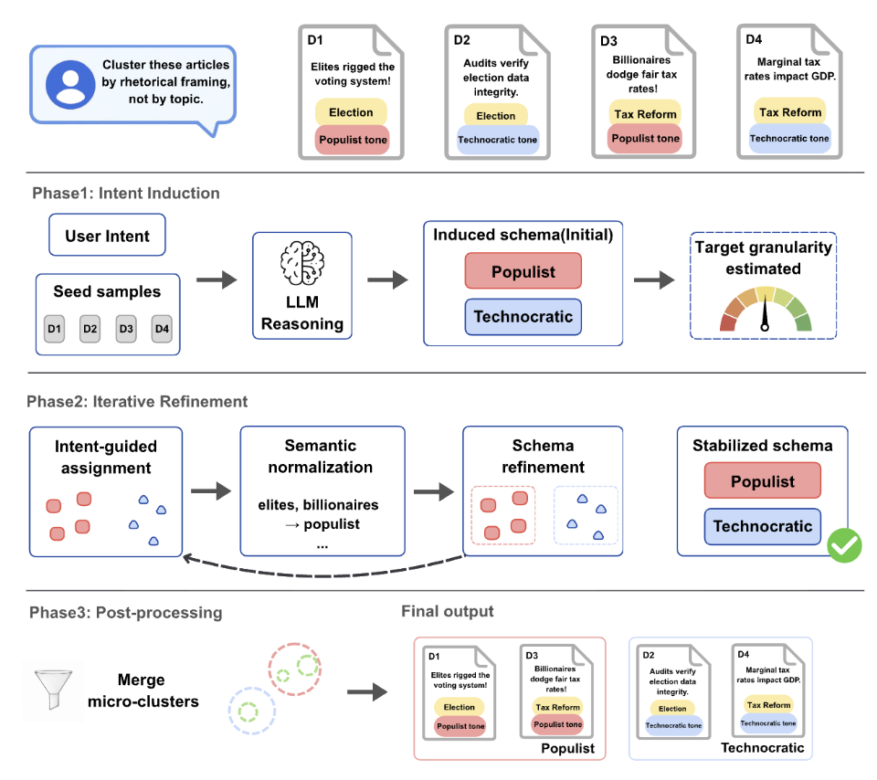

# Intent-Aligned Clustering

This repository contains the intent-aligned clustering pipeline, dataset samples,
evaluation helpers, LLM-as-a-judge scoring, and Sankey visualization utilities.

## Framework Flow



## Installation

```bash
uv sync                          # core dependencies
uv sync --extra bertopic         # include BERTopic optional dependency
```

## Common Commands

Run the LLM-based intent-aligned clustering pipeline:

```bash
iac --docs data/sample/sample.csv --prompt "$(cat data/sample/prompt.txt)" --model gpt-oss-20b --output out/sample
```

Run the TF-IDF + K-means++ baseline:

```bash
baseline --docs data/sample/sample.csv --prompt "$(cat data/sample/prompt.txt)" --output out/baseline_sample
```

Run the BERTopic comparator (requires `--extra bertopic`):

```bash
bertopic --docs data/sample/sample.csv --prompt "$(cat data/sample/prompt.txt)" --output out/bertopic_sample
```

Evaluate clustering results against ground truth (hard metrics):

```bash
evaluate --pred out/sample/out.csv --ground data/sample/sample_gt.csv --output out/sample/eval.json
```

### CLI Reference

| Command    | Key flags                                                                                                            |
| ---------- | -------------------------------------------------------------------------------------------------------------------- |
| `iac`      | `--docs`/`-d`, `--prompt`/`-p`, `--output`/`-o`, `--model`/`-m`, `--max_rounds`/`-r`, `--seed`/`-s`, `--no_postproc` |
| `baseline` | `--docs`/`-d`, `--prompt`/`-p`, `--output`/`-o`                                                                      |
| `bertopic` | `--docs`/`-d`, `--prompt`/`-p`, `--output`/`-o`                                                                      |
| `evaluate` | `--pred`/`-p`, `--ground`/`-g`, `--output`/`-o`, `--verbose`/`-v`                                                    |

Pass `--help` to any command for the full flag list.

Convert a sankey.json for [SankeyMATIC](https://sankeymatic.com/) visualization:

```bash
uv run python sankey-visualization/analyze_sankey.py out/sample/sankey.json > sankey-visualization/sankey-diagram
```
