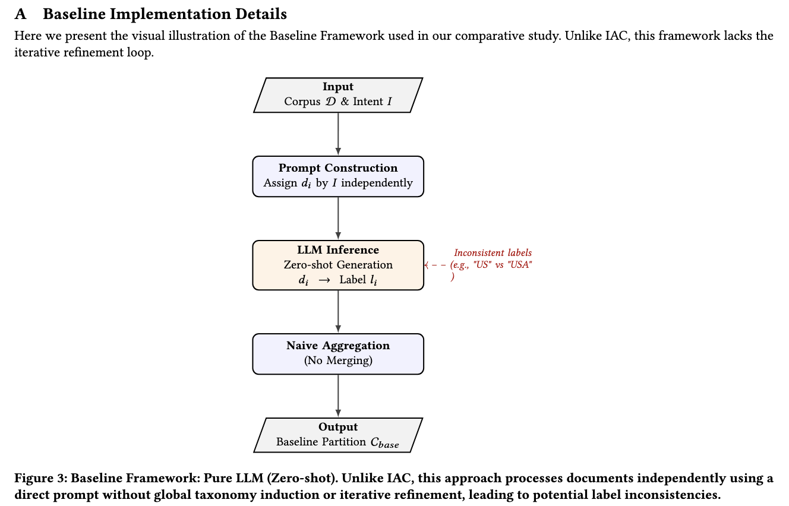

# Intent Aligned Clustering (IAC) Baseline

This project implements a baseline for Intent Aligned Clustering using a Zero-shot Labeling approach with LLMs.

## Overview

The baseline (located in `src2/`) follows this pipeline:
1.  **Input**: A collection of documents (CSV or directory) and a clustering intent/instruction.
2.  **Prompt Construction**: Creates a prompt for each document independently, asking an LLM to assign a label based on the intent.
3.  **LLM Inference**: Generates a label for each document (Zero-shot).
4.  **Aggregation**: Groups documents by exact label match.

the picture of baseline 


## Installation

Ensure you have Python 3.13+ installed.

1.  Install dependencies:
    ```bash
    pip install -r requirements.txt
    # OR if using uv/poetry
    uv sync
    ```
    *Note: Key dependencies include `ollama`, `scikit-learn`, `tqdm`, `python-dotenv`.*

2.  (Optional) Set up environment variables for the LLM:
    Create a `.env` file in the root directory:
    ```env
    OUTER_MEDUSA_ENDPOINT=your_endpoint_here
    OUTER_MEDUSA_API_KEY=your_api_key_here
    ```

## Usage

Run the baseline script from the project root:

```bash
python src2/main.py --docs <path_to_data> --intent "<your_instruction>" --output <output_dir>
```

### Arguments

-   `--docs`, `-d`: Path to the documents. Can be a CSV file (must have a `text` column) or a directory of `.txt` files.
-   `--intent`, `-i`: The clustering instruction or intent (e.g., "Classify by topic").
-   `--output`, `-o`: Directory to save results (default: `./out_src2`).
-   `--mock`: Use a mock LLM for testing purposes (no API calls).

### Examples

**Run with Mock LLM (for testing):**
```bash
python src2/main.py --docs sample.csv --intent "Classify these documents by topic" --output out_src2 --mock
```

**Run with Actual LLM:**
```bash
python src2/main.py --docs sample.csv --intent "Group these customer reviews by sentiment" --output results
```

## Output

The script generates two files in the output directory:
1.  `clustering.csv`: Contains `id` and `label` for each document.
2.  `summary.json`: Summary statistics including total documents, number of clusters, and cluster sizes.
